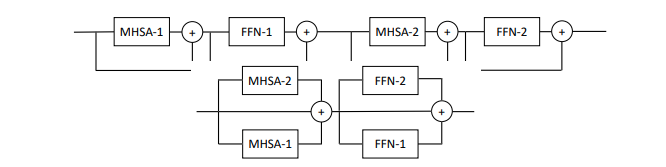

## Parallel ViT

</img>

"After their initial success in natural language processing, transformer architectures have rapidly gained traction in computer vision, providing state-of-the-art results for tasks such as image classification, detection, segmentation, and video analysis. We offer three insights based on simple and easy to implement variants of vision transformers. (1) The residual layers of vision transformers, which are usually processed sequentially, can to some extent be processed efficiently in parallel without noticeably affecting the accuracy. (2) Fine-tuning the weights of the attention layers is sufficient to adapt vision transformers to a higher resolution and to other classification tasks. This saves compute, reduces the peak memory consumption at fine-tuning time, and allows sharing the majority of weights across tasks. (3) Adding MLP-based patch pre-processing layers improves Bert-like self-supervised training based on patch masking. We evaluate the impact of these design choices using the ImageNet-1k dataset, and confirm our findings on the ImageNet-v2 test set. Transfer performance is measured across six smaller datasets." - Hugo Touvron, Matthieu Cord, Alaaeldin El-Nouby, Jakob Verbeek, Hervé Jégou

### Research Paper:
- https://arxiv.org/abs/2203.09795

### Official repository:
- https://github.com/facebookresearch/deit

### Usage:
```python
import numpy as np

key = jax.random.PRNGKey(0)

img = jax.random.normal(key, (1, 256, 256, 3))

v = ViT(
    image_size = 256,
    patch_size = 16,
    num_classes = 1000,
    dim = 1024,
    depth = 6,
    heads = 8,
    mlp_dim = 2048,
    num_parallel_branches = 2,  # in paper, they claimed 2 was optimal
    dropout = 0.1,
    emb_dropout = 0.1
)

init_rngs = {'params': jax.random.PRNGKey(1), 
            'dropout': jax.random.PRNGKey(2), 
            'emb_dropout': jax.random.PRNGKey(3)}

params = v.init(init_rngs, img)
output = v.apply(params, img, rngs=init_rngs)
print(output.shape)

n_params_flax = sum(
    jax.tree_leaves(jax.tree_map(lambda x: np.prod(x.shape), params))
)
print(f"Number of parameters in Flax model: {n_params_flax}")
```
### Citation:
```bibtex
@misc{https://doi.org/10.48550/arxiv.2203.09795,
  doi = {10.48550/ARXIV.2203.09795},
  
  url = {https://arxiv.org/abs/2203.09795},
  
  author = {Touvron, Hugo and Cord, Matthieu and El-Nouby, Alaaeldin and Verbeek, Jakob and Jégou, Hervé},
  
  keywords = {Computer Vision and Pattern Recognition (cs.CV), FOS: Computer and information sciences, FOS: Computer and information sciences},
  
  title = {Three things everyone should know about Vision Transformers},
  
  publisher = {arXiv},
  
  year = {2022},
  
  copyright = {arXiv.org perpetual, non-exclusive license}
}
```